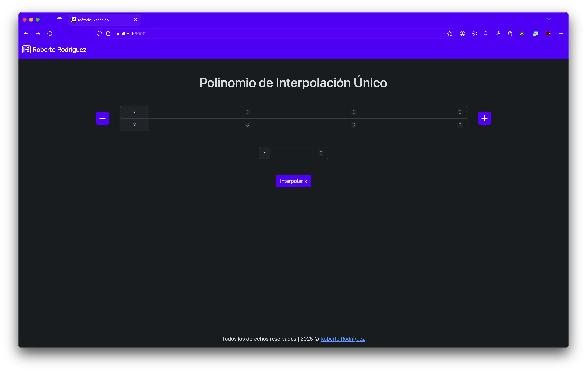
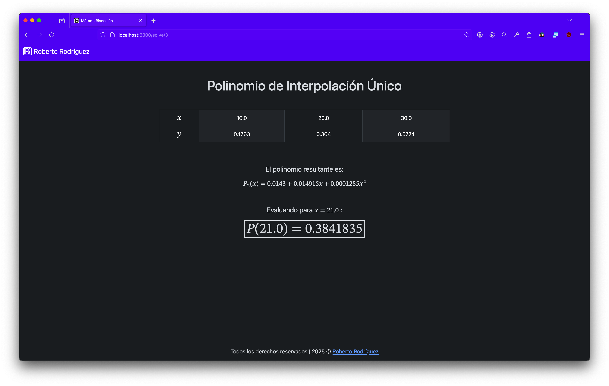
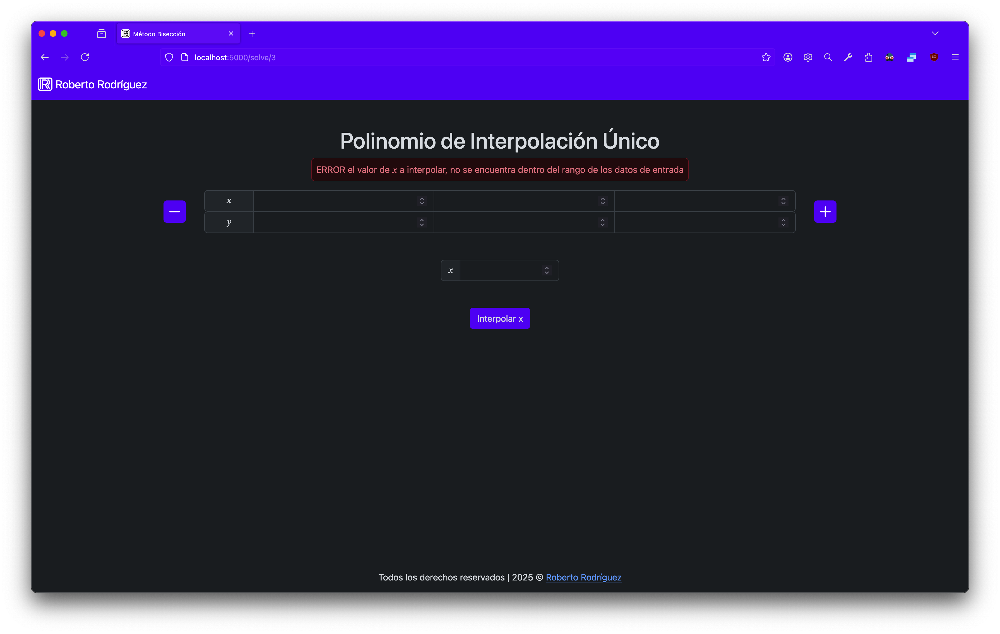
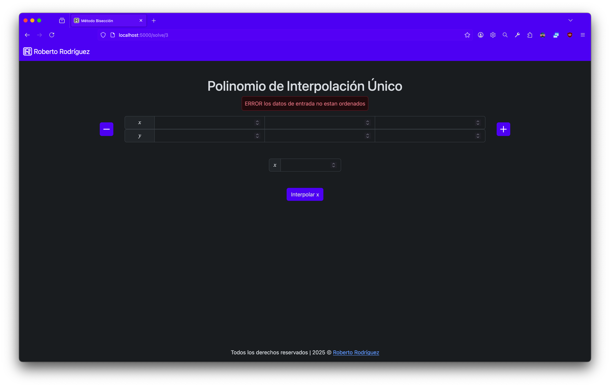

# Unique-Polynomial-Interpolation
Crea una función polinómica que pasa exactamente por todos los puntos de datos conocidos. Y predice el valor de 'y' para cualquier de 'x' dentro del rango de los datos originales. 

# Cómo Usar
## Configuración del Entorno
Antes de ejecutar la aplicación, es recomendable crear un entorno virtual de Python e instalar las dependencias necesarias. Sigue estos pasos:

1. **Crear un entorno virtual** (Ejecuta en la terminal, dentro de la carpeta del proyecto):
   ```sh
   python -m venv .venv
   ```
   ó
   ```sh
   python3 -m venv .venv
   ```
2. **Activar el entorno virtual**:
   - En Windows:
     ```sh
     .venv\Scripts\activate
     ```
   - En macOS/Linux:
     ```sh
     . .venv/bin/activate
     ```
3. **Instalar las dependencias**:
   ```sh
   pip install -r requirements.txt
   ```
   ó
   ```sh
   pip3 install -r requirements.txt
   ```
4. **Ejecutar la aplicación**:
   ```sh
   python app.py
   ```
   ó
   ```sh
   python3 app.py
   ```
5. Para entrar en la aplicación hay que entrar desde el navegador (preferentemente Firefox), en la url [localhost:5000](http://localhost:5000)

## Uso de la Aplicación
En la página de inicio podemos ingresar los pares de datos (x, y) en la tabla. Y el valor 'x' a interpolar. 


Una vez ingresados los datos hacemos clic en el botón "Interpolar x", lo que nos llevara a la página de solución, donde podremos los datos de entrada, el polinomio resultante y el valor de 'y' de la 'x' que interpolamos.


Si al ingresar los datos, intentamos interpolar un valor fuera del rango de los valores reales, obtendremos un error:


Si los pares de datos son ingresados de manera desordenada, obtendremos un error:


